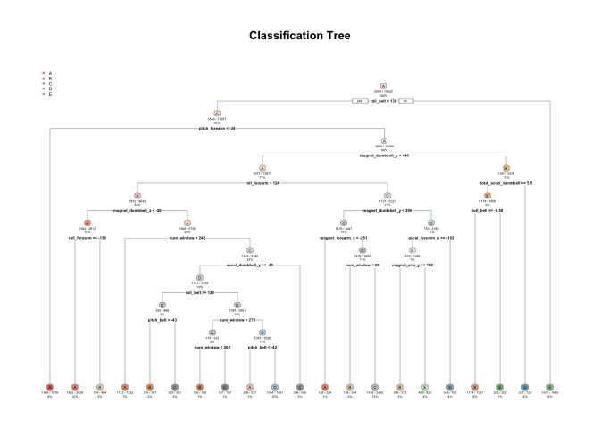

Prediction Assignment Writeupless
---------------------------------

Background

Using devices such as Jawbone Up, Nike FuelBand, and Fitbit it is now
possible to collect a large amount of data about personal activity
relatively inexpensively. These type of devices are part of the
quantified self movement – a group of enthusiasts who take measurements
about themselves regularly to improve their health, to find patterns in
their behavior, or because they are tech geeks. One thing that people
regularly do is quantify how much of a particular activity they do, but
they rarely quantify how well they do it. In this project, your goal
will be to use data from accelerometers on the belt, forearm, arm, and
dumbell of 6 participants. They were asked to perform barbell lifts
correctly and incorrectly in 5 different ways. More information is
available from the website here:
<http://groupware.les.inf.puc-rio.br/har> (see the section on the Weight
Lifting Exercise Dataset).

Load data first
===============

    getwd()

    ## [1] "/Users/rula/Larry/Coursera/Coursera_course8_ML_project"

    pml_train = read.csv("./pml-training.csv")
    pml_test = read.csv("./pml-testing.csv")
    library(caret)

    ## Warning: package 'caret' was built under R version 3.2.5

    ## Loading required package: lattice

    ## Loading required package: ggplot2

check dimension and names of variables
======================================

    names(pml_train)

    ##   [1] "X"                        "user_name"               
    ##   [3] "raw_timestamp_part_1"     "raw_timestamp_part_2"    
    ##   [5] "cvtd_timestamp"           "new_window"              
    ##   [7] "num_window"               "roll_belt"               
    ##   [9] "pitch_belt"               "yaw_belt"                
    ##  [11] "total_accel_belt"         "kurtosis_roll_belt"      
    ##  [13] "kurtosis_picth_belt"      "kurtosis_yaw_belt"       
    ##  [15] "skewness_roll_belt"       "skewness_roll_belt.1"    
    ##  [17] "skewness_yaw_belt"        "max_roll_belt"           
    ##  [19] "max_picth_belt"           "max_yaw_belt"            
    ##  [21] "min_roll_belt"            "min_pitch_belt"          
    ##  [23] "min_yaw_belt"             "amplitude_roll_belt"     
    ##  [25] "amplitude_pitch_belt"     "amplitude_yaw_belt"      
    ##  [27] "var_total_accel_belt"     "avg_roll_belt"           
    ##  [29] "stddev_roll_belt"         "var_roll_belt"           
    ##  [31] "avg_pitch_belt"           "stddev_pitch_belt"       
    ##  [33] "var_pitch_belt"           "avg_yaw_belt"            
    ##  [35] "stddev_yaw_belt"          "var_yaw_belt"            
    ##  [37] "gyros_belt_x"             "gyros_belt_y"            
    ##  [39] "gyros_belt_z"             "accel_belt_x"            
    ##  [41] "accel_belt_y"             "accel_belt_z"            
    ##  [43] "magnet_belt_x"            "magnet_belt_y"           
    ##  [45] "magnet_belt_z"            "roll_arm"                
    ##  [47] "pitch_arm"                "yaw_arm"                 
    ##  [49] "total_accel_arm"          "var_accel_arm"           
    ##  [51] "avg_roll_arm"             "stddev_roll_arm"         
    ##  [53] "var_roll_arm"             "avg_pitch_arm"           
    ##  [55] "stddev_pitch_arm"         "var_pitch_arm"           
    ##  [57] "avg_yaw_arm"              "stddev_yaw_arm"          
    ##  [59] "var_yaw_arm"              "gyros_arm_x"             
    ##  [61] "gyros_arm_y"              "gyros_arm_z"             
    ##  [63] "accel_arm_x"              "accel_arm_y"             
    ##  [65] "accel_arm_z"              "magnet_arm_x"            
    ##  [67] "magnet_arm_y"             "magnet_arm_z"            
    ##  [69] "kurtosis_roll_arm"        "kurtosis_picth_arm"      
    ##  [71] "kurtosis_yaw_arm"         "skewness_roll_arm"       
    ##  [73] "skewness_pitch_arm"       "skewness_yaw_arm"        
    ##  [75] "max_roll_arm"             "max_picth_arm"           
    ##  [77] "max_yaw_arm"              "min_roll_arm"            
    ##  [79] "min_pitch_arm"            "min_yaw_arm"             
    ##  [81] "amplitude_roll_arm"       "amplitude_pitch_arm"     
    ##  [83] "amplitude_yaw_arm"        "roll_dumbbell"           
    ##  [85] "pitch_dumbbell"           "yaw_dumbbell"            
    ##  [87] "kurtosis_roll_dumbbell"   "kurtosis_picth_dumbbell" 
    ##  [89] "kurtosis_yaw_dumbbell"    "skewness_roll_dumbbell"  
    ##  [91] "skewness_pitch_dumbbell"  "skewness_yaw_dumbbell"   
    ##  [93] "max_roll_dumbbell"        "max_picth_dumbbell"      
    ##  [95] "max_yaw_dumbbell"         "min_roll_dumbbell"       
    ##  [97] "min_pitch_dumbbell"       "min_yaw_dumbbell"        
    ##  [99] "amplitude_roll_dumbbell"  "amplitude_pitch_dumbbell"
    ## [101] "amplitude_yaw_dumbbell"   "total_accel_dumbbell"    
    ## [103] "var_accel_dumbbell"       "avg_roll_dumbbell"       
    ## [105] "stddev_roll_dumbbell"     "var_roll_dumbbell"       
    ## [107] "avg_pitch_dumbbell"       "stddev_pitch_dumbbell"   
    ## [109] "var_pitch_dumbbell"       "avg_yaw_dumbbell"        
    ## [111] "stddev_yaw_dumbbell"      "var_yaw_dumbbell"        
    ## [113] "gyros_dumbbell_x"         "gyros_dumbbell_y"        
    ## [115] "gyros_dumbbell_z"         "accel_dumbbell_x"        
    ## [117] "accel_dumbbell_y"         "accel_dumbbell_z"        
    ## [119] "magnet_dumbbell_x"        "magnet_dumbbell_y"       
    ## [121] "magnet_dumbbell_z"        "roll_forearm"            
    ## [123] "pitch_forearm"            "yaw_forearm"             
    ## [125] "kurtosis_roll_forearm"    "kurtosis_picth_forearm"  
    ## [127] "kurtosis_yaw_forearm"     "skewness_roll_forearm"   
    ## [129] "skewness_pitch_forearm"   "skewness_yaw_forearm"    
    ## [131] "max_roll_forearm"         "max_picth_forearm"       
    ## [133] "max_yaw_forearm"          "min_roll_forearm"        
    ## [135] "min_pitch_forearm"        "min_yaw_forearm"         
    ## [137] "amplitude_roll_forearm"   "amplitude_pitch_forearm" 
    ## [139] "amplitude_yaw_forearm"    "total_accel_forearm"     
    ## [141] "var_accel_forearm"        "avg_roll_forearm"        
    ## [143] "stddev_roll_forearm"      "var_roll_forearm"        
    ## [145] "avg_pitch_forearm"        "stddev_pitch_forearm"    
    ## [147] "var_pitch_forearm"        "avg_yaw_forearm"         
    ## [149] "stddev_yaw_forearm"       "var_yaw_forearm"         
    ## [151] "gyros_forearm_x"          "gyros_forearm_y"         
    ## [153] "gyros_forearm_z"          "accel_forearm_x"         
    ## [155] "accel_forearm_y"          "accel_forearm_z"         
    ## [157] "magnet_forearm_x"         "magnet_forearm_y"        
    ## [159] "magnet_forearm_z"         "classe"

    dim(pml_train)

    ## [1] 19622   160

    table(pml_train$classe)

    ## 
    ##    A    B    C    D    E 
    ## 5580 3797 3422 3216 3607

preprocessing
=============

First, I partitioned the training set

clear up near zero variance, missing values and descriptive fields.
===================================================================

    training <- pml_train[, 6:dim(pml_train)[2]]

    threshold = dim(training)[1]*0.8
    judge90 <- function (x) {
            sum(is.na(x))>threshold ||sum(x == "") > threshold
    }
    goodColumns = !apply(training, 2, judge90)
    training = training[,goodColumns]
    badCol = nearZeroVar(training, saveMetrics = TRUE)
    training = training [, badCol$nzv == FALSE]
    training$classe = factor(training$classe)

1.  train with different model

<!-- -->

    inTrain = createDataPartition(training$classe, p = 0.5)[[1]]
    trainset = training[inTrain,]
    crossVset = training[-inTrain,]

    inTrain = createDataPartition(crossVset$classe, p = 0.7)[[1]]
    crossTrain = crossVset [inTrain,]
    crossTest = crossVset[-inTrain,]

    testing = pml_test[, 6:dim(pml_test)[2]]
    testing = testing[, goodColumns]
    testing$classe = NA
    testing = testing [, badCol$nzv == FALSE]
    #mod1 = train(classe~., data = training, method = "rf")

    #pred1 = predict(mod1, testing)

Now we can train with different model. randomForest() is faster than
train("rf") Don't know why. train(method = "rf") takes forever to run.

    library(randomForest)

    ## randomForest 4.6-12

    ## Type rfNews() to see new features/changes/bug fixes.

    ## 
    ## Attaching package: 'randomForest'

    ## The following object is masked from 'package:ggplot2':
    ## 
    ##     margin

    mod1 =randomForest(classe~., data = training, method = "class")
    pre1 = predict (mod1, newdata = crossTrain, type = "class")

    acc1 = caret::confusionMatrix(pre1, crossTrain$classe)
    acc1

    ## $positive
    ## NULL
    ## 
    ## $table
    ##           Reference
    ## Prediction    A    B    C    D    E
    ##          A 1953    0    0    0    0
    ##          B    0 1329    0    0    0
    ##          C    0    0 1198    0    0
    ##          D    0    0    0 1126    0
    ##          E    0    0    0    0 1263
    ## 
    ## $overall
    ##       Accuracy          Kappa  AccuracyLower  AccuracyUpper   AccuracyNull 
    ##      1.0000000      1.0000000      0.9994631      1.0000000      0.2843209 
    ## AccuracyPValue  McnemarPValue 
    ##      0.0000000            NaN 
    ## 
    ## $byClass
    ##          Sensitivity Specificity Pos Pred Value Neg Pred Value Precision
    ## Class: A           1           1              1              1         1
    ## Class: B           1           1              1              1         1
    ## Class: C           1           1              1              1         1
    ## Class: D           1           1              1              1         1
    ## Class: E           1           1              1              1         1
    ##          Recall F1 Prevalence Detection Rate Detection Prevalence
    ## Class: A      1  1  0.2843209      0.2843209            0.2843209
    ## Class: B      1  1  0.1934779      0.1934779            0.1934779
    ## Class: C      1  1  0.1744068      0.1744068            0.1744068
    ## Class: D      1  1  0.1639249      0.1639249            0.1639249
    ## Class: E      1  1  0.1838696      0.1838696            0.1838696
    ##          Balanced Accuracy
    ## Class: A                 1
    ## Class: B                 1
    ## Class: C                 1
    ## Class: D                 1
    ## Class: E                 1
    ## 
    ## $mode
    ## [1] "sens_spec"
    ## 
    ## $dots
    ## list()
    ## 
    ## attr(,"class")
    ## [1] "confusionMatrix"

From the confusionMatrix result we can see the prediction is quite
right. Now let's look at "rpart" method

    library(rpart)
    library(rpart.plot)

    ## Warning: package 'rpart.plot' was built under R version 3.2.5

    mod2 = rpart(classe ~., data = training, method = "class")
    pre2 = predict (mod2, crossTrain, type = "class")
    acc2 = caret:: confusionMatrix(pre2, crossTrain$classe)
    rpart.plot(mod2, main = "Classification Tree", extra = 102, under = TRUE, faclen = 0)

    acc2

    ## $positive
    ## NULL
    ## 
    ## $table
    ##           Reference
    ## Prediction    A    B    C    D    E
    ##          A 1750  221   42   71   59
    ##          B   56  800   85  107  150
    ##          C   20   95  975  170   98
    ##          D  100  174   67  731  148
    ##          E   27   39   29   47  808
    ## 
    ## $overall
    ##       Accuracy          Kappa  AccuracyLower  AccuracyUpper   AccuracyNull 
    ##   7.372252e-01   6.667531e-01   7.266445e-01   7.476042e-01   2.843209e-01 
    ## AccuracyPValue  McnemarPValue 
    ##   0.000000e+00   7.778572e-67 
    ## 
    ## $byClass
    ##          Sensitivity Specificity Pos Pred Value Neg Pred Value Precision
    ## Class: A   0.8960573   0.9200570      0.8166122      0.9570461 0.8166122
    ## Class: B   0.6019564   0.9281588      0.6677796      0.9067184 0.6677796
    ## Class: C   0.8138564   0.9324634      0.7179676      0.9595355 0.7179676
    ## Class: D   0.6492007   0.9148529      0.5991803      0.9300761 0.5991803
    ## Class: E   0.6397466   0.9746700      0.8505263      0.9231289 0.8505263
    ##             Recall        F1 Prevalence Detection Rate
    ## Class: A 0.8960573 0.8544922  0.2843209      0.2547678
    ## Class: B 0.6019564 0.6331619  0.1934779      0.1164653
    ## Class: C 0.8138564 0.7629108  0.1744068      0.1419421
    ## Class: D 0.6492007 0.6231884  0.1639249      0.1064201
    ## Class: E 0.6397466 0.7302305  0.1838696      0.1176299
    ##          Detection Prevalence Balanced Accuracy
    ## Class: A            0.3119814         0.9080572
    ## Class: B            0.1744068         0.7650576
    ## Class: C            0.1976998         0.8731599
    ## Class: D            0.1776096         0.7820268
    ## Class: E            0.1383025         0.8072083
    ## 
    ## $mode
    ## [1] "sens_spec"
    ## 
    ## $dots
    ## list()
    ## 
    ## attr(,"class")
    ## [1] "confusionMatrix"

Now we cansee the rpart result is not accurate. The accuracy is only
74%. So we will choose "rf" method.

For the final testing data

    # predict final outcome levels on the original TESTING data using our mod1 algorithm
    finalpre = predict(mod1, testing, type = "class")
    finalpre

    ##  1  2  3  4  5  6  7  8  9 10 11 12 13 14 15 16 17 18 19 20 
    ##  B  A  B  A  A  E  D  B  A  A  B  C  B  A  E  E  A  B  B  B 
    ## Levels: A B C D E
